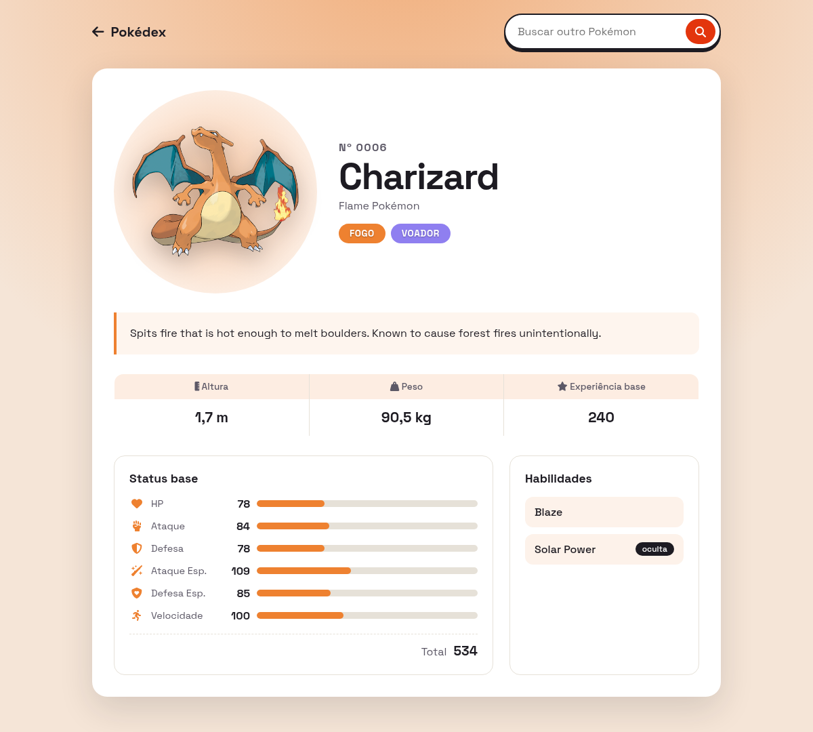

# Pokédex - atividade para uso de API

Autor: Guilherme Wohl

## Proposta da atividade

A ideia da atividade era escolher uma API pública, consumir os dados dela com `fetch` e mostrar essas informações numa página. Eu escolhi montar uma Pokédex: na primeira tela você digita o nome ou o número de um Pokémon, e se ele existir a aplicação abre uma página de detalhes com a ficha completa dele.

## API usada

[PokéAPI](https://pokeapi.co/docs/v2) - API gratuita, sem necessidade de chave, com os dados de todos os Pokémon.

### Endpoints usados

**`GET https://pokeapi.co/api/v2/pokemon/{nome ou número}`**

Usado nas duas páginas. Na busca serve para confirmar se o Pokémon existe (se a resposta for 404, aparece uma mensagem de erro na tela). Na página de detalhes eu uso os campos:

- `id` - número na Pokédex
- `name` - nome
- `sprites.other["official-artwork"].front_default` - arte oficial (se não tiver, uso `sprites.front_default`)
- `types` - tipos, mostrados como etiquetas; o primeiro tipo define a cor de fundo da página
- `height` e `weight` - altura (vem em decímetros) e peso (vem em hectogramas), convertidos para metros e quilos
- `base_experience` - experiência base
- `stats` - HP, ataque, defesa, ataque especial, defesa especial e velocidade, mostrados em barras de progresso (o máximo é 255)
- `abilities` - habilidades, marcando quais são ocultas
- `species.url` - link para o próximo endpoint

**`GET https://pokeapi.co/api/v2/pokemon-species/{id}`**

Usado para pegar as informações de texto:

- `genera` - a categoria do Pokémon (ex.: "Mouse Pokémon")
- `flavor_text_entries` - a descrição da Pokédex

Nos dois casos o código procura primeiro o texto em português (`pt-br`) e, se não encontrar, usa o inglês.

## Estrutura

- `index.html` - página de busca
- `pokemon.html` - página de detalhes, recebe o Pokémon pela URL (`pokemon.html?id=25`)
- `busca.js` - lógica da busca, usada nas duas páginas (a página de detalhes também tem um campo de busca no topo)
- `pokemon.js` - busca os dados do Pokémon e monta a ficha
- `style.css` - estilos das duas páginas

## Como rodar

1. Baixe todos os arquivos e deixe na mesma pasta.
2. Abra o `index.html` no navegador.
3. É preciso estar conectado à internet, porque os dados vêm da PokéAPI e os ícones/fontes vêm de CDN.

Não precisa instalar nada nem rodar servidor, os scripts são carregados como scripts normais. Se preferir, também funciona com a extensão Live Server do VS Code.

## Dificuldades

A parte que mais me deu trabalho foi entender que a PokéAPI separa as informações em mais de um endpoint. O `/pokemon` tem os status, tipos e imagem, mas a descrição e a categoria ficam no `/pokemon-species`, então tive que fazer uma segunda requisição usando a URL que vem dentro da primeira. Também descobri que a API não tinha texto em português em nenhum dos Pokémon que eu testei, por isso deixei o inglês como alternativa. Outra coisa foi tratar os erros direito: no começo, quando o nome não existia, a página simplesmente não fazia nada, e depois eu passei a verificar o `resposta.ok` e mostrar a mensagem na própria tela.
