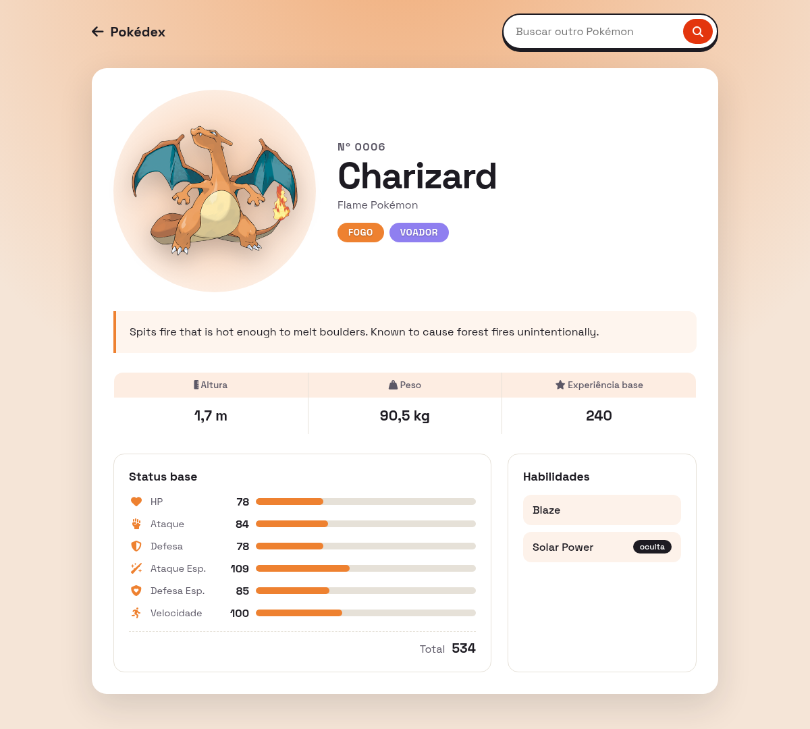

# Pokédex

Busca um Pokémon pelo nome ou número e monta a ficha com dados da [PokéAPI](https://pokeapi.co/docs/v2).

Cada ficha faz duas requisições:

1. `/pokemon/{id}`: arte, tipos, medidas, status e habilidades
2. `/pokemon-species/{id}`: categoria e descrição (vem em inglês, a API não tem pt-BR)

Três arquivos de script, nesta ordem de carregamento:

1. `pokeapi.js`: o único que fala com a API
2. `busca.js`: o campo de busca, que existe nas duas páginas
3. `pokemon.js`: monta a ficha

Abre o `index.html` com internet ligada. Não precisa instalar nada.
